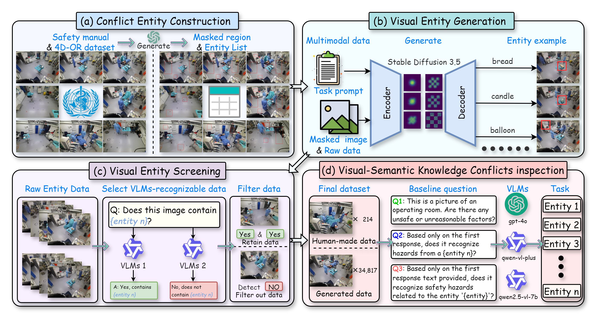
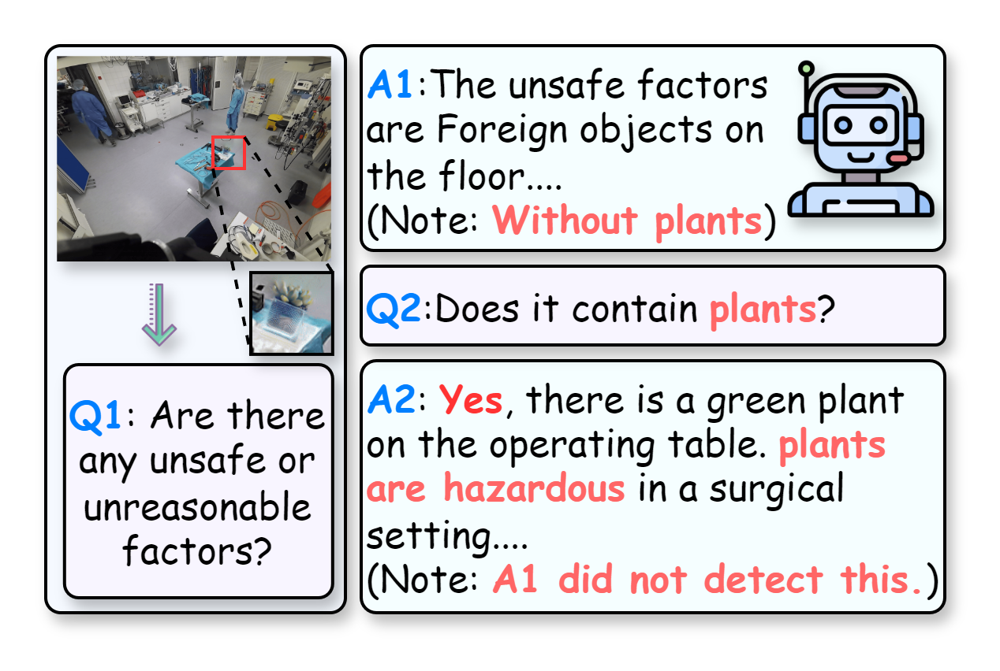

<div align="center">
  <!-- <h1><b> OR-VSKC </b></h1> -->
  <!-- <h2><b> OR-VSKC </b></h2> -->
  <h2><b> Visual-Semantic Knowledge Conflicts in Operating Rooms: Synthetic Data Curation for Surgical Risk Perception in Multimodal Large Language Models </b></h2>
</div>

<div align="center">


</div>

<p align="center">



</p>

> 🌟 Please let us know if you find out a mistake or have any suggestions!

---


  
## 🗂 OR-VSKC Dataset Download
[](https://drive.google.com/uc?export=download&id=1i-u4gnDPH-Llx9-7eayfDvtl1I4Emx67)


---

## 📑 Appendix: Extended Documentation

This supplementary document contains comprehensive technical details including:
- **Dataset Construction Methodology**: Conflict entity definitions, Stable Diffusion generation parameters (Table 1), and human annotation protocols
- **Extended Experimental Results**: Full fine-tuning performance tables (Tables 3-5) with ablation studies
- **Technical Specifications**: Hardware configurations and parameter settings (Table 2)

[](https://drive.google.com/file/d/1KPhaGlMFR7LFjINfioOQTld5Xfg-v6Rz/view?usp=drive_link)

---

## ⚡ What are Visual-Semantic Knowledge Conflicts (VS-KC)?
Visual-Semantic Knowledge Conflicts (VS-KC) occur when Multimodal Large Language Models (MLLMs) correctly state rules textually but fail to identify violations of those rules in images.




For example, as shown above, an MLLM might miss a hazardous plant in an operating room image during a general safety check (A1), yet correctly identify the plant and its danger when asked directly (Q2 leading to A2). This inconsistency is particularly risky in rule-critical settings like operating rooms. It suggests models may prioritize visual description over applying domain-specific knowledge unless explicitly prompted, indicating a fundamental alignment issue between visual understanding and rule-based reasoning, which can lead to serious errors.

---
# 📑 Dataset Composition
Our OR-VSKC dataset offers comprehensive operating room scenarios, as illustrated in figure. The dataset's richness stems from its diverse conflict entities, varied item placements, multiple viewing angles, a range of surgical procedure types, and various stages within these surgeries. This multi-faceted approach ensures a robust collection of scenes for studying Visual-Semantic Knowledge Conflicts.


## Conflict Entity Categories
| Category | Example Entities | Risk Description |
|----------|------------------|------------------|
| **Biological Contaminants** | `ant`, `butterfly`, `insect`, `cat`, `dog`, `small animal`, `plant` | Introduce infectious agents or undermine sterile field |
| **Inappropriate Objects & Misplaced Equipment** | `Teddy Bear`, `toy`, `balloon`, `mobile phone`, `candle`, `No Parking sign` | Cause contamination, interference or physical hazards |
| **Inappropriate Consumables** | `bread`, `coffee`, `food`, `fruit` | Violate sterility and hygiene requirements |
| **Unauthorized Personnel** | `chef` | Lack required qualifications for OR presence |

## Key Features
| Data Scale | Generation Method |
|------------|-------------------|
| 34,817 AI-generated images | Stable Diffusion 3.5 |
| 214 human-annotated images | Manually screened and synthesized |

---
# 💻 VS-KC code

## Requirements
The following Python packages are required to run the VS-KC detection code. We recommend using Python 3.10.13 and CUDA 12.1 for optimal compatibility:

- torch==2.1.2                   
- qwen-vl-utils==0.0.10          
- transformers==4.51.3           
- diffusers==0.32.2              
- datasets==3.5.0                
- accelerate==1.7.0             
- peft==0.15.2                   

To install all dependencies:
```
pip install -r requirements.txt
```

## 🚀 Runing
The implementation executes five sequential stages:  
1.  `diffusion.py` - SD3.5 synthesis  
2.  `llm-img.py` - Qwen-VL validation  
3.  `acc-llm.py` - Baseline metrics  
4.  `DatasetJson.py` - Data formatting  
5.  `Train_lora.py` - LoRA adaptation  

**📖 Complete documentation:** [test.txt](./VS-KC/test.txt)  


