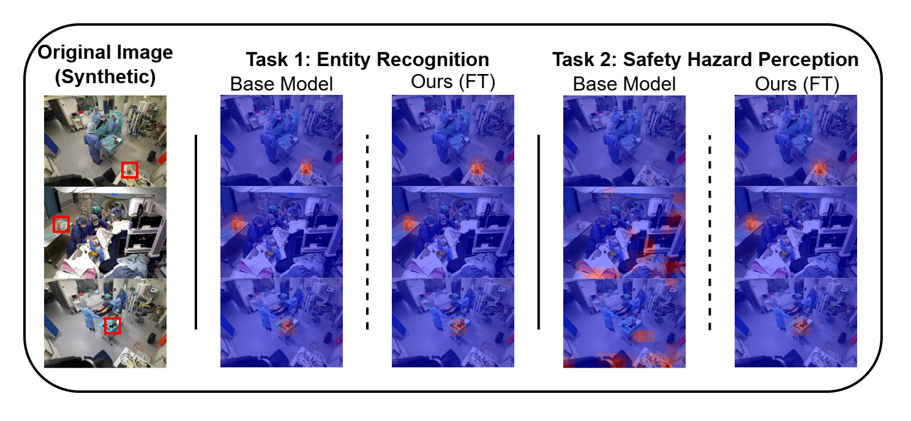

<div align="center">
  <h2><b>OR-VSKC: Resolving Visual-Semantic Knowledge Conflicts in Operating Rooms with Synthetic Data-Guided Alignment</b></h2>
</div>

<div align="center">


</div>

<p align="center">


</p>

<div > <b>>🎉 Our work has been accepted by IEEE Transactions on Multimedia (TMM)!</b> </div>
> 🌟 Please let us know if you find any mistakes or have any suggestions!


---

## ⚡ What are Visual-Semantic Knowledge Conflicts (VS-KC)?

Visual-Semantic Knowledge Conflicts (VS-KC) occur when Multimodal Large Language Models (MLLMs) possess the relevant safety knowledge but fail to activate it during visual inspection.

In operating rooms, this issue is especially risky: a model may correctly state that certain entities are unsafe or inappropriate in a surgical environment, but still fail to detect the same violation when it appears in an image under an open-ended safety-check prompt.

<p align="center">

</p>

For example, as shown above, an MLLM might miss a hazardous plant in an operating room image during a general safety check, yet correctly identify the plant and explain its danger when asked directly. This inconsistency suggests a gap between visual perception and protocol-grounded safety reasoning.

OR-VSKC is designed to study this perception–reasoning misalignment in safety-critical operating-room environments.

---

# 📑 Dataset Composition

OR-VSKC is a benchmark for studying Visual-Semantic Knowledge Conflicts (VS-KC) and surgical risk perception in operating rooms.

The benchmark is constructed from authentic operating-room contexts drawn from both **4D-OR** and **CAMMA-MVOR**. The **4D-OR-based portion** serves as the primary benchmark core, while the **CAMMA-MVOR-based portion** is reserved for external validation and cross-dataset generalization analysis.

The full OR-VSKC release contains:

- **28,190 machine-screened synthetic images**
- **713 expert-authored and multi-expert-validated challenge images**

<p align="center">

</p>

<p align="center">

</p>

---

## Conflict Entity Categories

OR-VSKC categorizes visual-semantic conflicts into three hierarchical levels according to semantic plausibility and occurrence frequency.

| Category | Example Entities | Context & Risk Description |
| :--- | :--- | :--- |
| **Common Mistakes**<br>*(High-Frequency Violations)* | `mobile phone`, `bread`, `coffee`, `fruit`, `food` | **Everyday Negligence:** Items strictly prohibited but plausibly introduced due to human error. These entities pose sterility, hygiene, or workflow risks in the operating room. |
| **Occasional Mistakes**<br>*(Environmental Breaches)* | `ant`, `cat`, `insect`, `plant`, `candle` | **Environmental Control Lapses:** Rare but safety-critical breaches involving biological contaminants, flora/fauna, or fire hazards. These entities test whether MLLMs can detect low-probability but high-consequence OR safety violations. |
| **Unreasonable Conflicts**<br>*(Semantic Absurdities)* | `chef`, `balloon`, `Teddy Bear`, `No Parking sign` | **Logical Impossibilities:** Entities that violate the semantic logic of a surgical suite. These examples stress-test common-sense reasoning and hallucination resistance in safety-critical OR scenes. |

---

## Key Dataset Splits

| Dataset Component | Data Scale | Source Domain | Usage |
| :--- | :---: | :--- | :--- |
| **Full Synthetic OR-VSKC Set** | **28,190** images | 4D-OR + CAMMA-MVOR | Full synthetic release |
| **4D-OR Synthetic Core Set** | **26,992** images | 4D-OR | Primary benchmark core and main quantitative analysis |
| **CAMMA-MVOR Synthetic Set** | **1,198** images | CAMMA-MVOR | External validation and cross-dataset generalization |
| **Full Expert-Authored Challenge Set** | **713** images | 4D-OR + CAMMA-MVOR | High-fidelity evaluation |
| **4D-OR Expert-Authored Challenge Set** | **509** images | 4D-OR | Primary expert-authored benchmark |
| **CAMMA-MVOR Expert-Authored Challenge Set** | **204** images | CAMMA-MVOR | External expert-authored validation |

---

## Expert-Authored Challenge Subset

To complement the large-scale synthetic release, OR-VSKC includes a **713-image expert-authored and multi-expert-validated challenge subset**.

This challenge subset was constructed and verified by a six-member interdisciplinary clinical–AI panel:

- **Four clinical experts**, who assessed clinical plausibility, patient-safety relevance, and consistency with realistic operating-room safety expectations.
- **Two AI experts**, who assessed visual construction quality, technical feasibility, and suitability for MLLM evaluation.

Each candidate image was independently reviewed according to four criteria:

1. Clinical plausibility of the scene.
2. Visual clarity and unambiguity of the target entity.
3. Semantic clarity of the safety violation.
4. Absence of confounding artifacts.

A candidate sample was retained only if it received approval from at least four experts. The finalized challenge subset achieved a mean expert approval rate of **97.5%**, with near-perfect inter-rater agreement.


---
# 🔍 Interpretability Analysis

To better understand how fine-tuning mitigates Visual-Semantic Knowledge Conflicts (VS-KC), we provide an occlusion-sensitivity visualization comparing the base model and the fine-tuned model under two different prompting settings.

<p align="center">

</p>

The visualization compares model grounding behavior across three representative operating-room scenes. The first column shows the original synthetic images, where red boxes indicate the ground-truth conflict entities. The following columns show occlusion-sensitivity heatmaps under two tasks:

- **Task 1: Entity Recognition**  
  The model is explicitly asked whether the image contains the target entity, such as `coffee` or `mobile phone`.

- **Task 2: Safety Hazard Perception**  
  The model receives an open-ended safety-scanning prompt and must determine whether unsafe or unreasonable factors are present.

Under the explicit entity-recognition prompt, both the base model and the fine-tuned model can localize the target objects, indicating that the base model already possesses the perceptual capability to detect these visually salient foreign entities.

However, under the open-ended safety-scanning prompt, the base model exhibits scattered or background-focused activation, suggesting that it fails to connect the detected object with the corresponding operating-room safety rule. In contrast, the fine-tuned model concentrates its activation on the violating entity itself, showing that OR-VSKC fine-tuning strengthens the linkage between visual evidence and protocol-grounded safety reasoning.

This result supports the core claim of OR-VSKC: many VS-KC failures are not caused by pure object-recognition failure, but by a missing connection between visual perception and safety-rule activation.

---

# 🗂 OR-VSKC Dataset Download

[](https://drive.google.com/file/d/1Y-rLaCzhNGOPvbMIoeAd2-tuVpcvb2m9/view?usp=sharing)

The released dataset includes the 4D-OR-based synthetic core set, the CAMMA-MVOR-based synthetic validation set, and the expert-authored challenge subsets.

---

# 💻 VS-KC Code

## Requirements

The following Python packages are required to run the VS-KC detection code. We recommend using Python 3.10.13 and CUDA 12.1 for compatibility.

```bash
torch==2.1.2
qwen-vl-utils==0.0.10
transformers==4.51.3
diffusers==0.32.2
datasets==3.5.0
accelerate==1.7.0
peft==0.15.2
